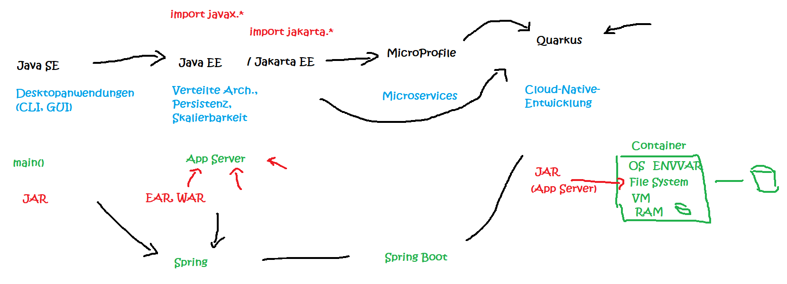
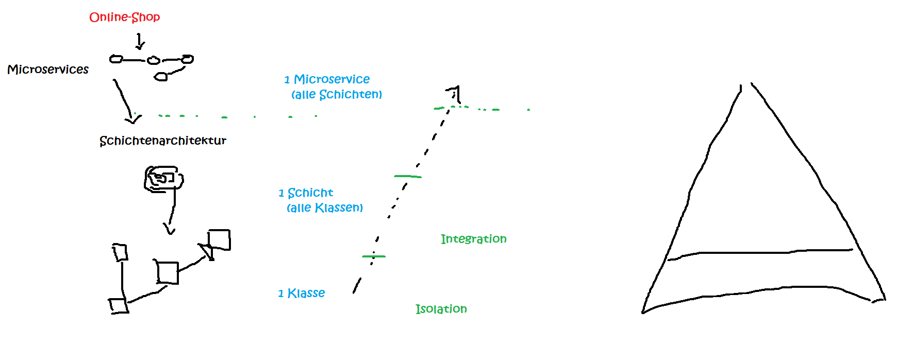
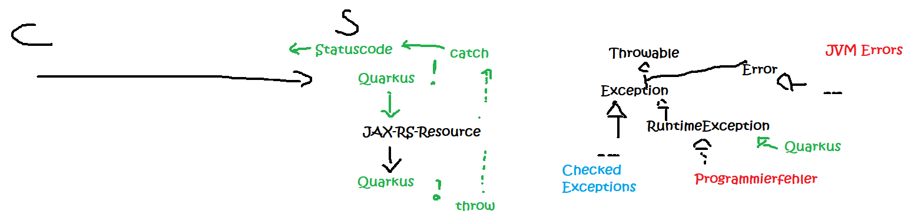
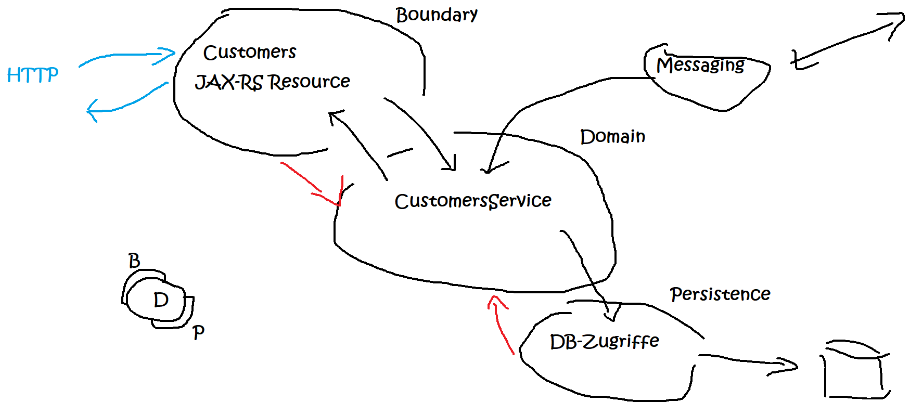
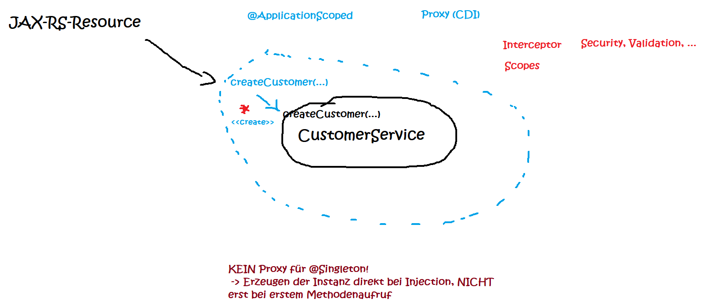

# Mitschriften

## Einordnung in die technische Umwelt

## Testkonzepte

## Exceptions

## Onion Architecture

## `@Singleton` vs `@ApplicationScoped`

Bei `@Singleton` wird kein Proxy erzeugt. Das kann notwendig sein, z.B. wenn die Klasse `final` ist.

